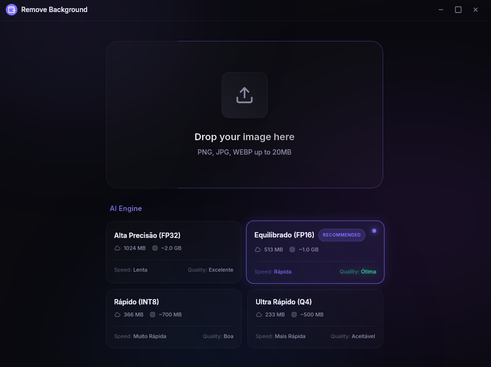
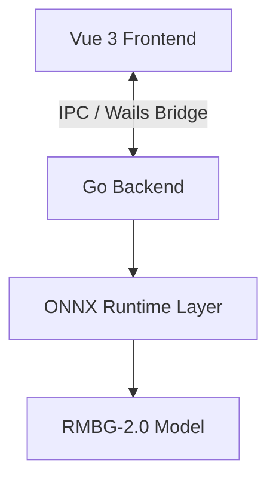

# Remove Background Go

A high-performance, 100% offline desktop application for background removal from images. Built with **Wails v2**, **Go**, and **Vue 3**, powered by the **RMBG-2.0 (BiRefNet)** model via **ONNX Runtime**.



## 🚀 Features

- **100% Offline**: No images are uploaded to any server. All processing happens locally.
- **High Accuracy**: Uses the state-of-the-art **RMBG-2.0** model.
- **Fast Performance**: GPU-accelerated (on supported systems) and optimized with ONNX Runtime.
- **Modern UI**: Clean, responsive interface with a "before and after" comparison slider.
- **Privacy First**: Your data never leaves your machine.

---

## 🛠️ Tech Stack

| Layer             | Technology                    |
| ----------------- | ----------------------------- |
| Desktop Framework | [Wails v2](https://wails.io/) |
| Backend           | Go 1.24+                      |
| Frontend          | Vue 3 + TypeScript            |
| Styling           | Tailwind CSS v3               |
| ML Inference      | ONNX Runtime (via CGO)        |
| Model             | RMBG-2.0 (BiRefNet)           |

---

## 📋 Prerequisites

Before you begin, ensure you have the following installed:

- **Go**: Version 1.24 or higher.
- **Node.js & npm**: For frontend development.
- **Wails CLI**: Install via `go install github.com/wailsapp/wails/v2/cmd/wails@latest`.
- **ONNX Runtime**: The shared library (`libonnxruntime.so`) must be installed on your system.

### Installing ONNX Runtime (Linux)

You can use the provided `Makefile` to set up ONNX Runtime automatically on Ubuntu/Debian-based systems:

```bash
make setup
```

Alternatively, manually:

1. Download the ONNX Runtime binaries from the [official releases](https://github.com/microsoft/onnxruntime/releases).
2. Copy `libonnxruntime.so.x.y.z` to `/usr/lib/x86_64-linux-gnu/` (or equivalent for your OS).
3. Run `sudo ldconfig`.

---

## 📂 Project Structure

```text
remove-bg-go/
├── app.go            # Wails Application Logic
├── internal/
│   └── inference/    # ONNX Inference Module (Go)
├── models/
│   └── RMBG-2.0/     # AI Model (ONNX format)
├── frontend/         # Vue 3 Frontend
└── build/            # Build Artifacts
```

---

## 🏗️ Architecture & Data Flow

The application follows a clean separation between the frontend (Vue 3) and the backend (Go), communicating via Wails IPC.



### 🧠 Processing Pipeline

1. **Input**: Image is converted to Base64 in the frontend and sent to Go.
2. **Preprocessing**:
   - Resize to **1024x1024**.
   - Normalization (mean=0.5, std=0.5).
   - NCHW format conversion `[1, 3, 1024, 1024]`.
3. **Inference**: Computed via ONNX Runtime (CGO).
4. **Postprocessing**:
   - Mask resizing to original dimensions.
   - Alpha channel application.
   - PNG encoding.
5. **Output**: Resulting Base64 image returned to the UI.

---

## 🚀 How to Run

### Development Mode

Run the following command to start the application with hot-reloading:

```bash
# Install dependencies
go mod tidy
cd frontend && npm install

# Run application
wails dev
```

### Production Build

To build a standalone executable:

```bash
make build
# Or
wails build
```

The binary will be located in `build/bin/remove-bg-go`.

---

## 🧠 Model Information

This application uses the **RMBG-2.0** model, which is a state-of-the-art background removal model developed by [BRIA AI](https://huggingface.co/briaai/RMBG-2.0).

- **Input Size**: 1024x1024 (Auto-resized)
- **Format**: ONNX (FP16 optimized)
- **Size**: ~977MB

---

## ⚠️ Troubleshooting

### CGO and LD_LIBRARY_PATH

Since ONNX Runtime uses CGO, you must ensure `CGO_ENABLED=1` during build. If you encounter issues finding the `.so` file at runtime, you can specify the path:

```bash
export LD_LIBRARY_PATH=$LD_LIBRARY_PATH:/path/to/onnxruntime/libs
./remove-bg-go
```

---

## 📄 License

This project is licensed under the MIT License - see the [LICENSE](LICENSE) file for details.

## 🤝 Contributing

Contributions are welcome! Please feel free to submit a Pull Request.

---

Made with ❤️ by [Oscar Silva](https://github.com/your-username)
